# springbootA358
springbootA358基于Web的出租车拼车系统
 
## 查看主页获取源码

### 一、作品包含

源码+数据库+设计文档万字+PPT+全套环境和工具资源+部署教程

### 二、项目技术

前端技术：Html、Css、Js、Vue2.0、Element-ui 
数据库：MySQL
后端技术：Java、SpringBoot2.0、MyBatis

  

### 三、运行环境

开发工具：IDEA/eclipse  + vscode

数据库：MySQL5.7（最低要5.7版本）

数据库管理工具：Navicat10以上版本

环境配置软件： JDK1.8 + Maven3.6.3

前端Nodejs：14

浏览器：谷歌浏览器

### 四、项目介绍
项目编号：springbootA358

出租车拼车系统是为了方便用户能够在网站上查看拼单信息、交流论坛等，于是开发了基于springboot框架设计与实现了一款简洁、轻便的出租车拼车系统。本系统解决了出租车拼车管理事务中的主要问题，包括以下多个功能模块：用户、司机、实名认证、拼车订单、拼单信息、拼单申请、确认信息、评分信息、取消信息等管理。

### 五、运行截图

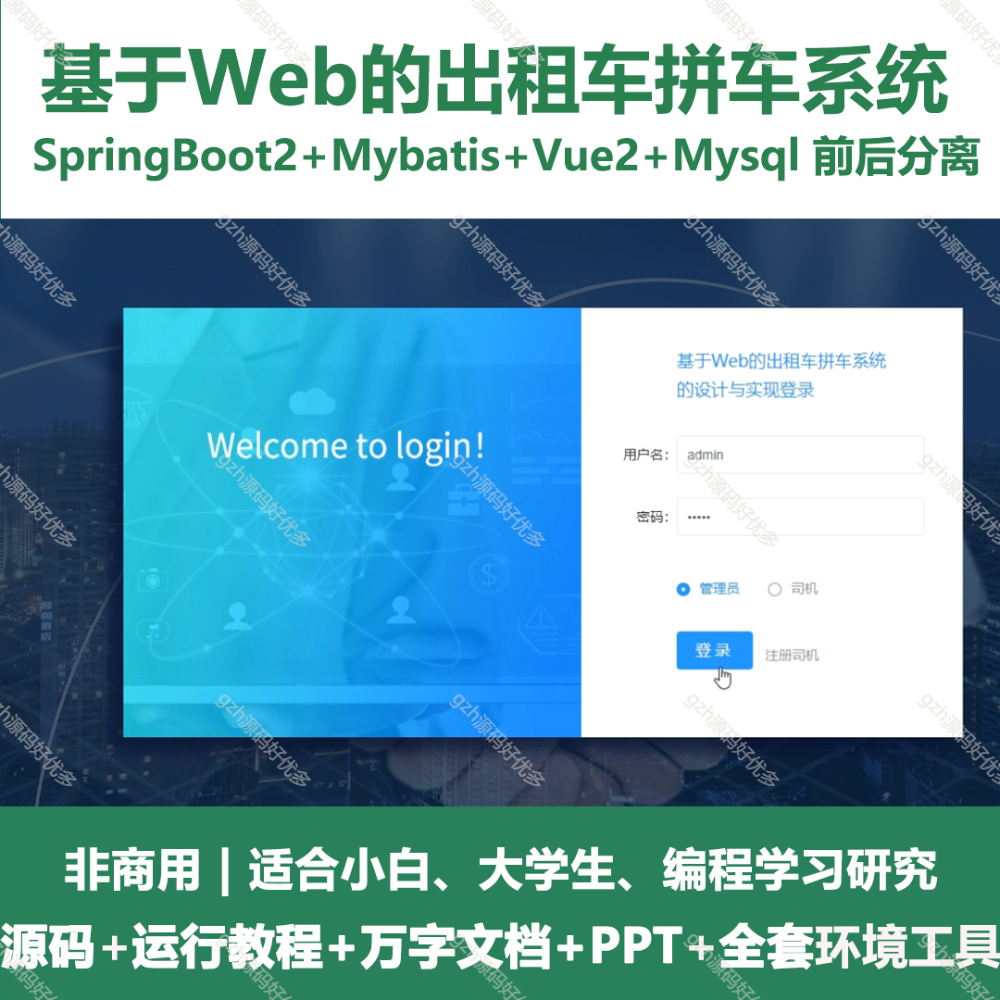

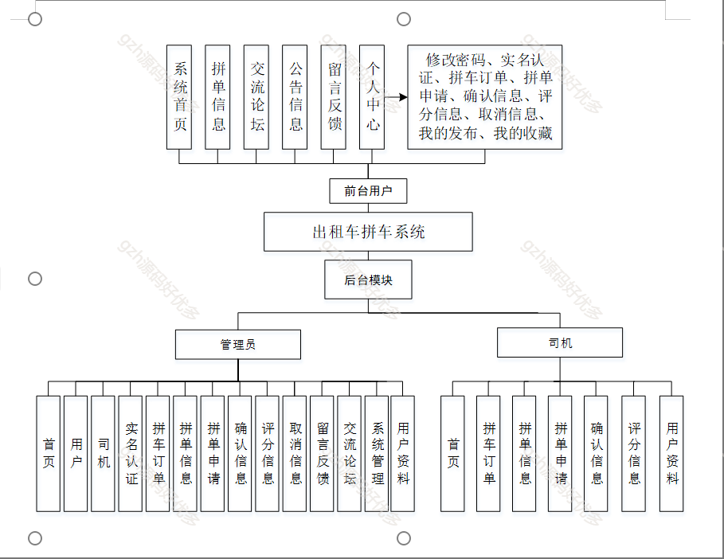
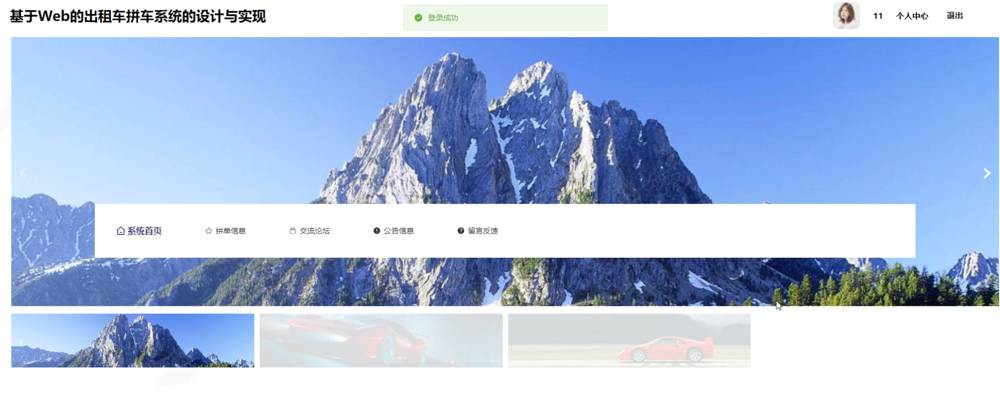
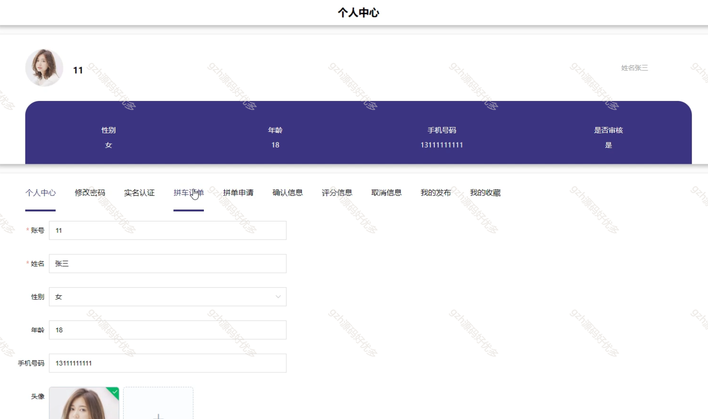
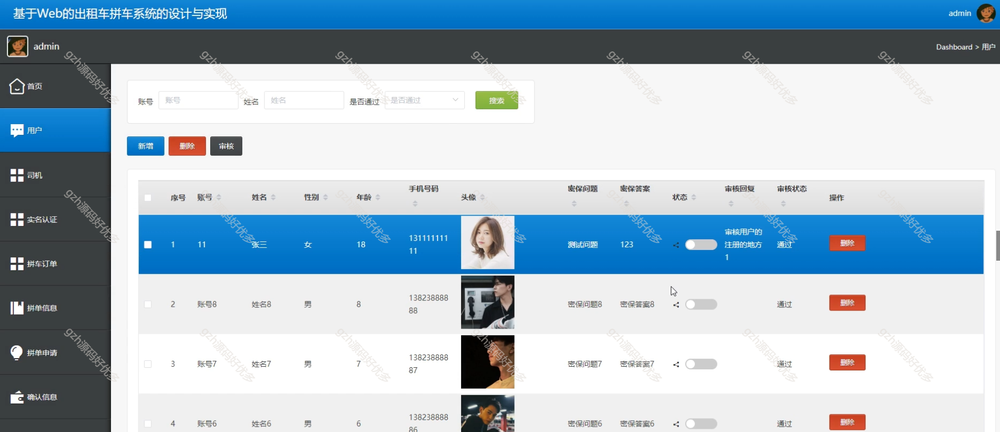
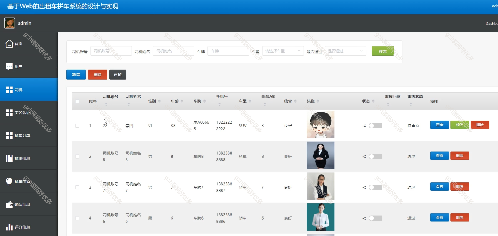
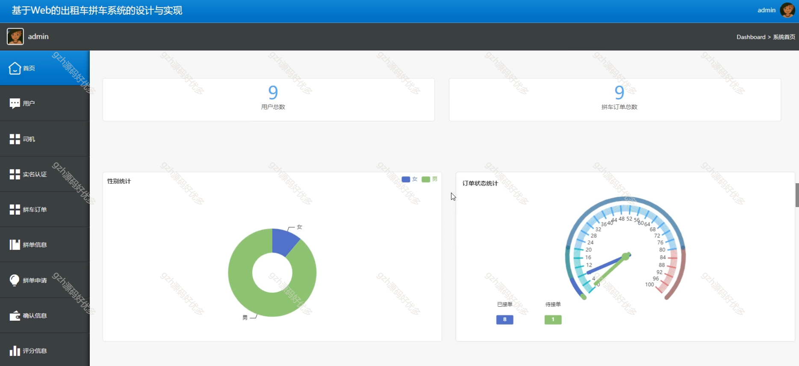
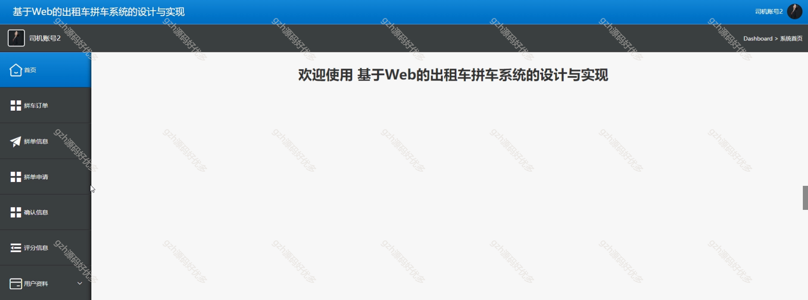
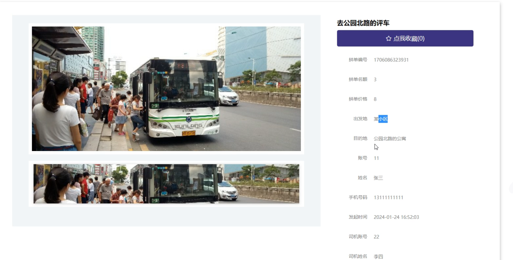
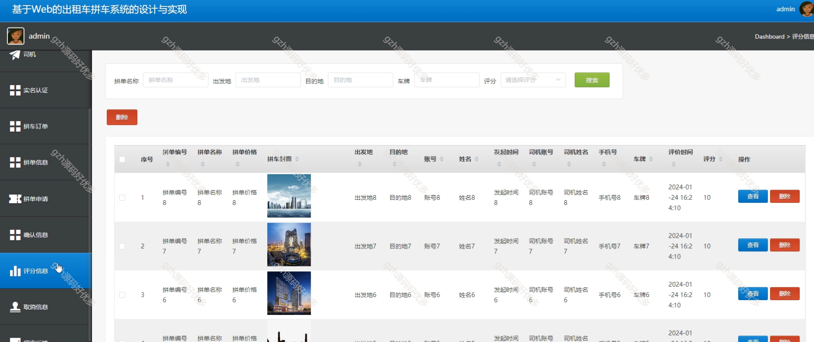
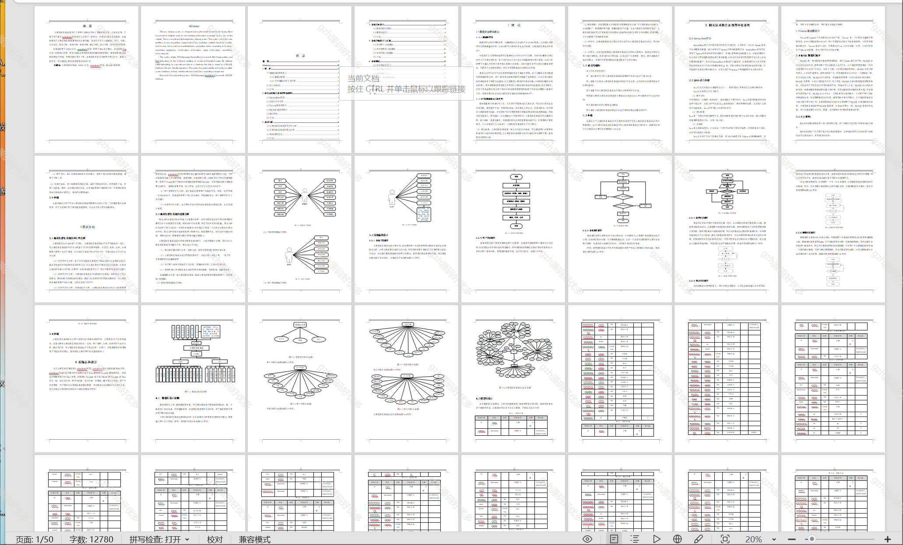

  
